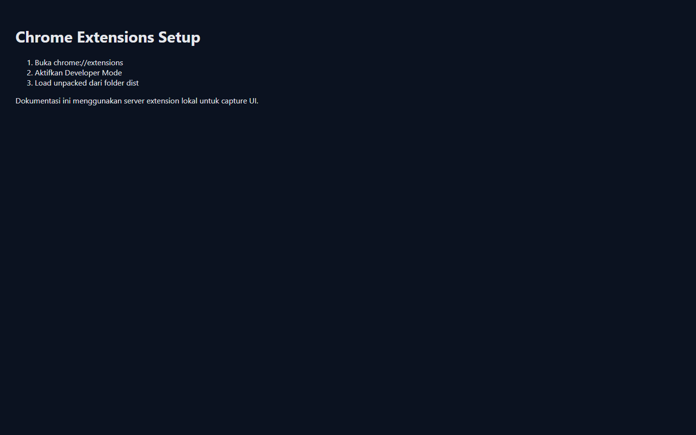
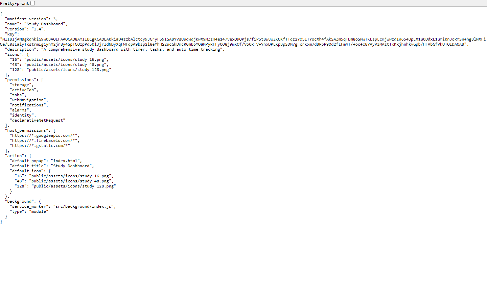

# Study Dashboard

Chrome extension for study management, task tracking, class organization, deadlines, and cloud sync.

Ekstensi Chrome untuk manajemen belajar, pengelolaan tugas, pengaturan kelas, deadline, dan sinkronisasi cloud.

## Quick Links

- Download latest package: [StudyFlow-v1.4.zip](./StudyFlow-v1.4.zip)
- Screenshots folder: [docs/screenshots](./docs/screenshots)

## Repository Purpose / Tujuan Repository

This repository is the distribution repository for the **Study Dashboard** Chrome extension. It is intended to store the latest packaged build artifact and release-oriented documentation.

Repository ini adalah repository distribusi untuk Chrome extension **Study Dashboard**. Fungsinya untuk menyimpan artefak build terbaru yang siap dipakai serta dokumentasi rilis.

This is not meant to be the main development repository. The release package is built from the extension source workspace, then packaged into a `.zip` file for installation through Chrome developer mode.

Repository ini bukan fokus utama untuk pengembangan source code. Paket rilis dibangun dari source extension, lalu dikemas menjadi file `.zip` untuk dipasang melalui mode developer di Chrome.

## Release Information / Informasi Rilis

| Field | Value |
| --- | --- |
| Product / Produk | `Study Dashboard` |
| Type / Tipe | `Chrome Extension` |
| Latest Version / Versi Terbaru | `1.4` |
| Manifest | `V3` |
| Package / Paket | `StudyFlow-v1.4.zip` |
| Distribution Repo | `whyith699-netizen/StudyFlow` |

## Overview / Ringkasan

Study Dashboard is designed to centralize common academic workflows in a browser popup. It combines task management, class scheduling, deadline visibility, timer support, and account-based sync into one compact extension experience.

Study Dashboard dirancang untuk memusatkan alur kerja akademik umum dalam popup browser. Ekstensi ini menggabungkan manajemen tugas, jadwal kelas, visibilitas deadline, dukungan timer, dan sinkronisasi berbasis akun dalam satu pengalaman yang ringkas.

The current `v1.4` package in this repository is a production build. The output has been minified and bundled for distribution, and the previous `v1.3` zip has been removed so the repository stays focused on the latest release.

Paket `v1.4` saat ini di repository ini adalah hasil build production. Output sudah diminify dan dibundle untuk distribusi, dan file zip `v1.3` sebelumnya telah dihapus agar repository tetap fokus pada rilis terbaru.

## Main Features / Fitur Utama

### Task Management / Manajemen Tugas

- Create, edit, and delete tasks.
- Mark tasks as important.
- Mark tasks as completed.
- Set deadlines with date and time.
- Group tasks by class.
- Review upcoming and completed work.

- Membuat, mengedit, dan menghapus task.
- Menandai task sebagai penting.
- Menandai task sebagai selesai.
- Mengatur deadline beserta tanggal dan waktu.
- Mengelompokkan task berdasarkan kelas.
- Melihat pekerjaan yang akan datang maupun yang sudah selesai.

### Class Organization / Organisasi Kelas

- Create multiple classes or subjects.
- Attach class-related links such as Zoom or Drive.
- Configure schedules by day.
- Use class-specific icons or identity markers.
- View tasks connected to a class.

- Membuat banyak kelas atau mata pelajaran.
- Menambahkan tautan terkait kelas seperti Zoom atau Drive.
- Mengatur jadwal berdasarkan hari.
- Menggunakan ikon atau identitas untuk tiap kelas.
- Melihat tugas yang terhubung ke kelas tertentu.

### Cloud Sync / Sinkronisasi Cloud

- Firebase-based synchronization.
- Google sign-in support.
- Email and password authentication.
- User-scoped data separation.

- Sinkronisasi berbasis Firebase.
- Dukungan login Google.
- Autentikasi email dan password.
- Pemisahan data per pengguna.

### Productivity Dashboard / Dashboard Produktivitas

- Fast popup-based workflow in Chrome.
- Deadline reminders and notifications.
- Search and filtering support.
- Timer and study activity workflow.
- Responsive popup layout.

- Alur kerja cepat melalui popup di Chrome.
- Pengingat deadline dan notifikasi.
- Dukungan pencarian dan filter.
- Fitur timer dan aktivitas belajar.
- Layout popup yang responsif.

## Screenshots / Tangkapan Layar

### Installation / Instalasi

Chrome Extensions page before loading unpacked:

Halaman Chrome Extensions sebelum memuat extension:

Manifest view from the built extension package:

Tampilan manifest dari hasil build extension:

### Dashboard

Main popup dashboard:

Dashboard popup utama:

### Class Detail

Class detail view:

Tampilan detail kelas:

### Tasks

Task list view:

Tampilan daftar tugas:

### Theme and Language

Theme and language settings view:

Tampilan pengaturan tema dan bahasa:

## Package Contents / Isi Paket

The distributed zip contains the built output from the extension `dist/` folder, including:

File zip distribusi berisi output build dari folder `dist/` extension, termasuk:

- `manifest.json`
- `index.html`
- `service-worker-loader.js`
- `assets/`
- `public/assets/icons/`
- `.vite/`

This means the zip is ready for use after extraction and is not a raw development source snapshot.

Artinya, file zip ini siap dipakai setelah diekstrak dan bukan snapshot source development mentah.

## Installation Guide / Panduan Instalasi

### English

1. Download [StudyFlow-v1.4.zip](./StudyFlow-v1.4.zip).
2. Extract the zip to a local folder.
3. Open `chrome://extensions/`.
4. Enable `Developer mode`.
5. Click `Load unpacked`.
6. Select the extracted folder.
7. Open the extension from the Chrome toolbar.

### Bahasa Indonesia

1. Download [StudyFlow-v1.4.zip](./StudyFlow-v1.4.zip).
2. Extract file zip ke folder lokal.
3. Buka `chrome://extensions/`.
4. Aktifkan `Developer mode`.
5. Klik `Load unpacked`.
6. Pilih folder hasil extract.
7. Buka extension dari toolbar Chrome.

## First Use / Penggunaan Awal

### English

1. Open the extension popup.
2. Sign in with Google or with email/password.
3. Add one or more classes.
4. Add tasks and deadlines.
5. Use the dashboard to monitor your study workflow.

### Bahasa Indonesia

1. Buka popup extension.
2. Login dengan Google atau email/password.
3. Tambahkan satu atau beberapa kelas.
4. Tambahkan task dan deadline.
5. Gunakan dashboard untuk memantau alur belajar.

## Updating to New Versions / Update ke Versi Baru

Extensions installed using `Load unpacked` do not update automatically. To update:

Extension yang dipasang menggunakan `Load unpacked` tidak update otomatis. Untuk memperbarui:

### English

1. Download the latest zip from this repository.
2. Replace the old extracted folder with the new one.
3. Open `chrome://extensions/`.
4. Find `Study Dashboard`.
5. Click `Reload`.

### Bahasa Indonesia

1. Download zip terbaru dari repository ini.
2. Ganti folder extract lama dengan folder yang baru.
3. Buka `chrome://extensions/`.
4. Cari `Study Dashboard`.
5. Klik `Reload`.

## Changelog / Catatan Perubahan

### v1.4

- Latest production package rebuilt and distributed as `StudyFlow-v1.4.zip`.
- Distribution repository now keeps only the latest zip artifact.
- README expanded with bilingual documentation.
- Added badges, screenshot gallery, installation steps, and release details.
- Verified manifest release version remains `1.4`.

- Paket production terbaru dibangun ulang dan didistribusikan sebagai `StudyFlow-v1.4.zip`.
- Repository distribusi sekarang hanya menyimpan artefak zip terbaru.
- README diperluas dengan dokumentasi bilingual.
- Ditambahkan badge, galeri screenshot, langkah instalasi, dan detail rilis.
- Versi rilis pada manifest terverifikasi tetap `1.4`.

### v1.3

- Previous distribution zip version before the current release.
- Removed from this repository after `v1.4` was published.

- Versi zip distribusi sebelum rilis saat ini.
- Dihapus dari repository ini setelah `v1.4` dipublikasikan.

## Technical Details / Detail Teknis

| Area | Value |
| --- | --- |
| Build tool | `Vite` |
| UI | `React` |
| Extension plugin | `@crxjs/vite-plugin` |
| Minifier | `terser` |
| Obfuscation | `rollup-plugin-obfuscator` |
| Current package version | `1.4.0` in package metadata |
| Current manifest version | `1.4` in `manifest.json` |

The production build removes `console` and `debugger` statements and outputs bundled assets suitable for release packaging.

Build production menghapus `console` dan `debugger`, lalu menghasilkan asset bundle yang sesuai untuk pengemasan rilis.

## Permissions / Permission

The currently packaged extension uses the following main permissions:

Extension yang saat ini dikemas menggunakan permission utama berikut:

- `storage`
- `activeTab`
- `tabs`
- `webNavigation`
- `notifications`
- `alarms`
- `identity`
- `declarativeNetRequest`

Host permissions:

Host permission:

- `https://*.googleapis.com/*`
- `https://*.firebaseio.com/*`
- `https://*.gstatic.com/*`

These are used for storage, authentication, sync, browser integration, reminders, and related extension features.

Permission tersebut dipakai untuk penyimpanan, autentikasi, sinkronisasi, integrasi browser, pengingat, dan fitur extension terkait.

## Security and Privacy / Keamanan dan Privasi

### English

- User data is tied to authenticated access.
- Cloud-backed behavior depends on Firebase configuration.
- Client-side credentials still require secure backend rules.
- This repository is intended for distribution artifacts, not server secrets.

### Bahasa Indonesia

- Data pengguna terikat pada akses yang sudah diautentikasi.
- Perilaku sinkronisasi cloud bergantung pada konfigurasi Firebase.
- Kredensial sisi klien tetap memerlukan aturan backend yang aman.
- Repository ini ditujukan untuk artefak distribusi, bukan penyimpanan rahasia server.

## Troubleshooting / Pemecahan Masalah

### If the extension does not load / Jika extension tidak mau dimuat

1. Make sure you selected the extracted folder, not the zip file.
2. Confirm `Developer mode` is enabled.
3. Reload the extension from `chrome://extensions/`.
4. Check Chrome error messages shown under the extension card.
5. Remove and load the unpacked extension again if needed.

1. Pastikan yang dipilih adalah folder hasil extract, bukan file zip.
2. Pastikan `Developer mode` aktif.
3. Reload extension dari `chrome://extensions/`.
4. Cek pesan error Chrome di bawah kartu extension.
5. Hapus lalu load unpacked ulang jika diperlukan.

### If sign-in or sync fails / Jika login atau sync gagal

1. Verify your internet connection.
2. Reload the extension.
3. Try signing in again.
4. Review the Firebase-side setup in the source project if the issue persists.

1. Periksa koneksi internet.
2. Reload extension.
3. Coba login ulang.
4. Tinjau konfigurasi Firebase di source project jika masalah tetap muncul.

## Distribution Workflow / Alur Distribusi

### English

1. Build the extension in production mode.
2. Verify the manifest version.
3. Package the `dist/` output into `StudyFlow-v1.4.zip`.
4. Replace the previous release artifact.
5. Update release documentation.
6. Commit and push to `origin/main`.

### Bahasa Indonesia

1. Build extension dalam mode production.
2. Verifikasi versi manifest.
3. Kemas output `dist/` menjadi `StudyFlow-v1.4.zip`.
4. Ganti artefak rilis sebelumnya.
5. Perbarui dokumentasi rilis.
6. Commit dan push ke `origin/main`.

## Developer Note / Catatan Developer

This repository focuses on release delivery. Source-level feature development should happen in the extension source workspace, then be rebuilt and republished here.

Repository ini fokus pada distribusi rilis. Pengembangan fitur pada level source sebaiknya dilakukan di workspace source extension, lalu dibuild ulang dan dipublikasikan kembali ke sini.

## Support / Dukungan

If you find an issue in the packaged release, start by checking the installation steps and the Chrome extension error panel.

Jika Anda menemukan masalah pada paket rilis, mulai dari memeriksa langkah instalasi dan panel error extension di Chrome.

For future releases, the recommended flow is to update the extension source, run a fresh production build, generate a new zip version, and then refresh this distribution repository.

Untuk rilis berikutnya, alur yang disarankan adalah memperbarui source extension, menjalankan build production baru, membuat versi zip baru, lalu menyegarkan repository distribusi ini.
